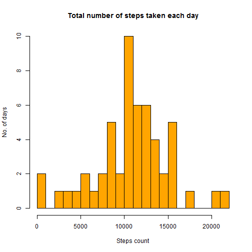
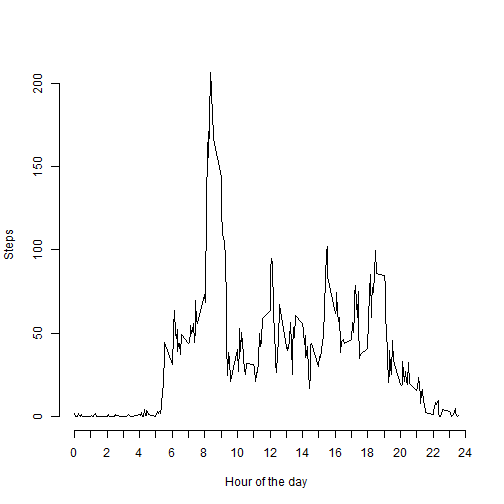
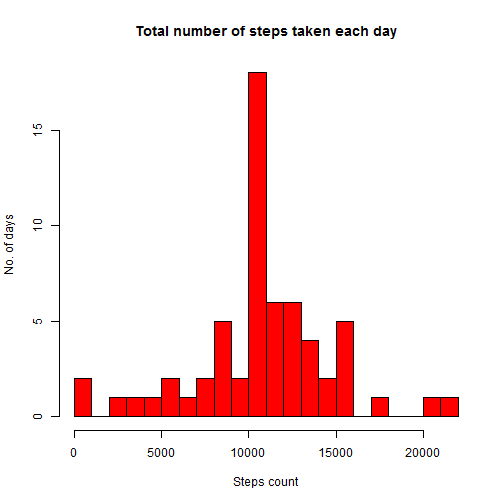
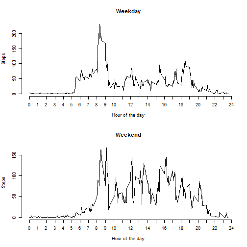

Reproducible Research: Peer Assessment 1
=============================================
---
title: "Reproducible Research: Peer Assessment 1"
output: 
  html_document:
    keep_md: true
    *Srikanth Guhan*
---


## Loading and preprocessing the data


```r
data<-read.csv("activity.csv",header = TRUE)
data$date<-as.Date(data$date)
attach(data)
```

```
## The following objects are masked from data (pos = 3):
## 
##     date, interval, steps
## 
## The following objects are masked from data (pos = 4):
## 
##     date, interval, steps
## 
## The following objects are masked from data (pos = 6):
## 
##     date, interval, steps
## 
## The following objects are masked from data (pos = 8):
## 
##     date, interval, steps
```


## What is mean total number of steps taken per day?

* A histogram of the total number of steps taken each day

```r
groupSum<-aggregate(steps ~ date, data, sum)
hist(x = groupSum$steps,breaks = 20,xlab = "Steps count",ylab = "No. of days",main = "Total number of steps taken each day",col = "orange")
```

 

* The mean and median total number of steps taken per day

```r
mean(groupSum$steps)
```

```
## [1] 10766.19
```

```r
median(groupSum$steps)
```

```
## [1] 10765
```

## What is the average daily activity pattern?

* A time series plot of the 5-minute interval and the average number of steps taken, averaged across all days

```r
groupMean<-aggregate(steps~interval,data,mean)
plot(x = groupMean$interval,y = groupMean$steps,type="l",xlab="Hour of the day",ylab="Steps",axes=FALSE)
axis(side = 1,at = seq(0,2400,100),labels = seq(0,24))
axis(2)
```

 

* 5-minute interval, on average across all the days in the dataset, containing the maximum number of steps

```r
x<-groupMean$interval[groupMean$steps==max(groupMean$steps)]
paste0(round(x/100,digits = 0),":",x-round(x,digits = -2)," Hours")
```

```
## [1] "8:35 Hours"
```
## Imputing missing values

* The total number of missing values in the dataset

```r
sum(is.na(steps))
```

```
## [1] 2304
```

* A strategy for filling in all of the missing values in the dataset; replacing with 5 minute average of other days
* New dataset

```r
impute<-data
for(i in 1:max(row(data))){
    if(is.na(steps[i])){
        impute$steps[i]<-groupMean$steps[groupMean$interval==data$interval[i]]
    }
}
```

* Histogram of the total number of steps taken each day and the mean and median

```r
groupSumI<-aggregate(steps ~ date, impute, sum)
hist(x = groupSumI$steps,breaks = 20,xlab = "Steps count",ylab = "No. of days",main = "Total number of steps taken each day",col = "red")
```

 

```r
mean(groupSumI$steps)
```

```
## [1] 10766.19
```

```r
median(groupSumI$steps)
```

```
## [1] 10766.19
```

```r
mean(groupSumI$steps)-mean(groupSum$steps)
```

```
## [1] 0
```

```r
100*(median(groupSumI$steps)-median(groupSum$steps))/median(groupSum$steps)
```

```
## [1] 0.01104207
```
Mean doesn't change but median changes by a negligible amount

## Are there differences in activity patterns between weekdays and weekends?

* New factor variable in the dataset with two levels -- "weekday" and "weekend"
* Panel plot containing a time series plot of the 5-minute interval and the average number of steps taken, averaged across all weekday days or weekend days

```r
library(chron)
weekDay<-NULL
for(i in 1:max(row(impute))){
    ifelse(is.weekend(impute$date[i]),weekDay[i]<-"Weekend",weekDay[i] <-"Weekday"             ) 
    }
impute<-cbind(impute,weekDay)

groupMeanI<-aggregate(steps~interval+weekDay,impute,mean)

par(mfcol = c(2,1),cex = 0.75)
with(impute,{
    plot(x = groupMeanI$interval[groupMeanI$weekDay=="Weekday"],y = groupMeanI$steps[groupMeanI$weekDay=="Weekday"],type="l",xlab="Hour of the day",ylab="Steps",axes=FALSE, main="Weekday")
axis(side = 1,at = seq(0,2400,100),labels = seq(0,24))
axis(2)

plot(x = groupMeanI$interval[groupMeanI$weekDay=="Weekend"],y = groupMeanI$steps[groupMeanI$weekDay=="Weekend"],type="l",xlab="Hour of the day",ylab="Steps",axes=FALSE, main="Weekend")
axis(side = 1,at = seq(0,2400,100),labels = seq(0,24))
axis(2)
})
```

 
